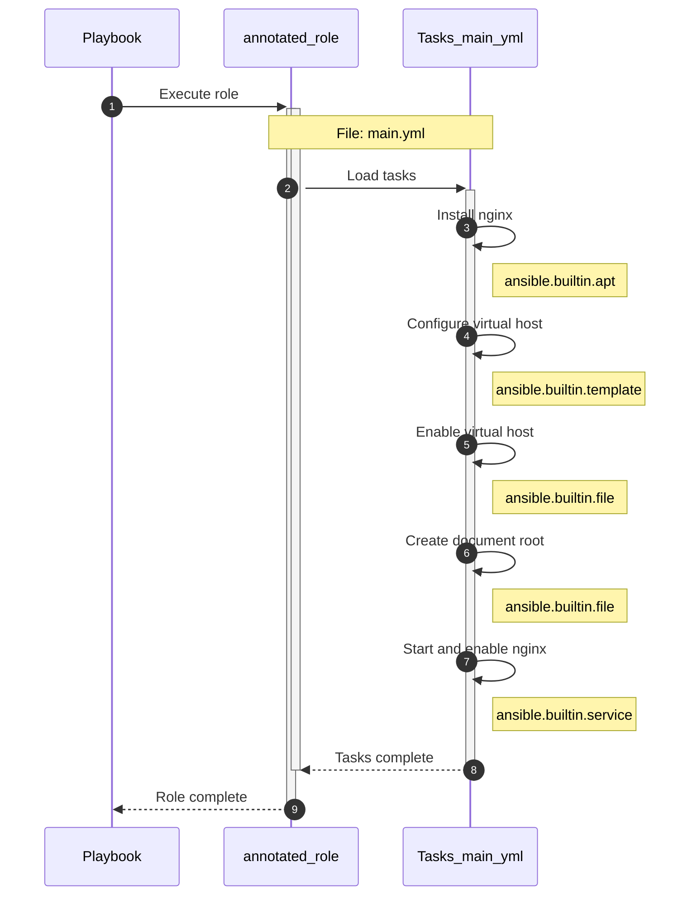
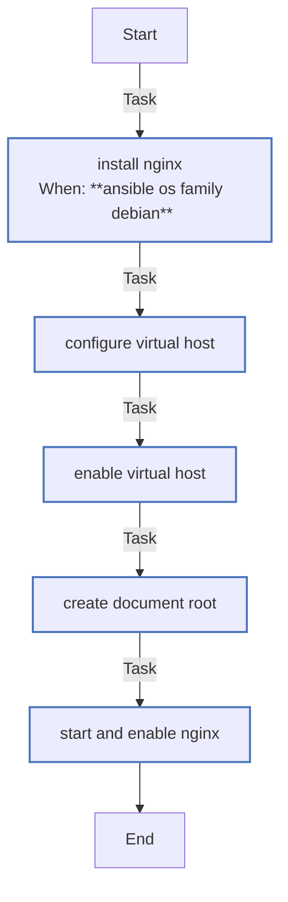

<!-- DOCSIBLE METADATA
generated_at: 2026-03-13T18:43:52.021725+00:00Z
docsible_version: 0.9.0
role_hash: 61e6686fbb10787c3ee7ab5395155068b66f9593856a8e7119871a7140f317c5
-->

<!-- DOCSIBLE START -->
# 📃 Role overview
## annotated_role

### Author Information
- **Author**: docsible-examples
- **License**: MIT
- **Platforms**:

- Ubuntu: ['focal', 'jammy']

- Debian: ['bullseye', 'bookworm']

Description: Example webserver role demonstrating docsible comment tags

### Defaults
**These are static variables with lower priority**

#### File: defaults/main.yml

| Var | Type | Value | Choices | Required | Title |
|-----|------|-------|---------|----------|-------|
| [webserver_port](https://github.com/jier/docsible/blob/jier-update-comment-tags/defaults/main.yml#L6) | int | `80` | 80, 443, 8080, 8443 | true | Web server port |
| [webserver_server_name](https://github.com/jier/docsible/blob/jier-update-comment-tags/defaults/main.yml#L11) | str | `example.com` |  | true | Server name |
| [webserver_document_root](https://github.com/jier/docsible/blob/jier-update-comment-tags/defaults/main.yml#L16) | str | `/var/www/html` |  | false | Document root |
| [webserver_https_redirect](https://github.com/jier/docsible/blob/jier-update-comment-tags/defaults/main.yml#L20) | bool | `False` |  | false | Enable HTTPS redirect |
| [webserver_worker_processes](https://github.com/jier/docsible/blob/jier-update-comment-tags/defaults/main.yml#L25) | str | `auto` | auto, 1, 2, 4, 8 | false | Worker processes |
| [webserver_access_log](https://github.com/jier/docsible/blob/jier-update-comment-tags/defaults/main.yml#L29) | str | `/var/log/nginx/access.log` |  | false | Access log path |
| [webserver_error_log_level](https://github.com/jier/docsible/blob/jier-update-comment-tags/defaults/main.yml#L34) | str | `warn` | debug, info, notice, warn, error, crit | false | Error log level |
| [webserver_keepalive_timeout](https://github.com/jier/docsible/blob/jier-update-comment-tags/defaults/main.yml#L37) | int | `65` |  |  |  |

  

    <b>🖇️ Full descriptions for vars in defaults/main.yml</b>
  

   
  <table>
    <th>Var</th>
    <th>Description</th>
    <tr>
      <td><b>webserver_port</b></td>
      <td>TCP port on which the web server listens for incoming connections</td>
    </tr>
    <tr>
      <td><b>webserver_server_name</b></td>
      <td>Hostname or domain name served by this virtual host</td>
    </tr>
    <tr>
      <td><b>webserver_document_root</b></td>
      <td>Absolute path to the directory containing web content</td>
    </tr>
  </table>
   

#### File: tasks/main.yml
| Task Name | Module | Has Conditions | Description |
|-----------|--------|----------------|-------------|
| Install nginx | ansible.builtin.apt | True | Install the web server package before any configuration takes place |
| Configure virtual host | ansible.builtin.template | False | Deploy the virtual host configuration generated from the role template |
| Enable virtual host | ansible.builtin.file | False | Enable the site by symlinking into sites-enabled |
| Create document root | ansible.builtin.file | False | Ensure the document root directory exists with correct permissions |
| Start and enable nginx | ansible.builtin.service | False | Start and enable the service so it survives reboots |

## Execution Flow
This sequence diagram shows the linear task execution flow:

## Task Details

### Tasks in main.yml

*No role dependencies*

<!-- DOCSIBLE END -->
