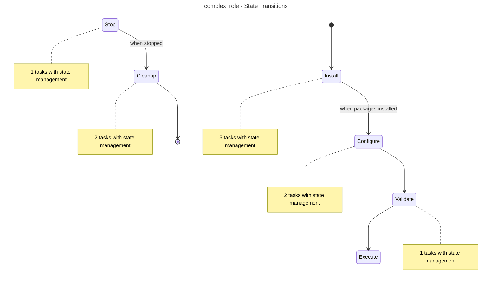
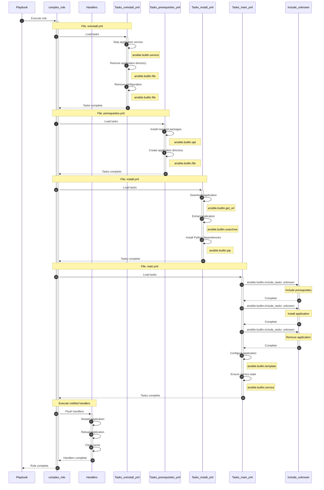

<!-- DOCSIBLE METADATA
generated_at: 2025-12-19T10:13:04.735956+00:00Z
docsible_version: 0.8.0
role_hash: 9f5db66940d046875aea45c86aa4d2051bdc813d4035e3e95df1278db8f8758a
-->


<!-- DOCSIBLE START -->
# 📃 Role overview
## complex_role


### Author Information
- **Author**: Test Author
- **License**: MIT
- **Platforms**:

- Ubuntu: ['focal', 'jammy']

- Debian: ['bullseye']


Description: A complex test role with state management


### Defaults
**These are static variables with lower priority**

#### File: defaults/main.yml

| Var | Type | Value |
|-----|------|-------|
| [title](https://github.com/jier/docsible/blob/claude/modularize-ansible-codebase-01JY3Hhe3hMvzeaTb9dbyMVY/defaults/main.yml#L2) | str | `Complex Role Variables` |
| [description](https://github.com/jier/docsible/blob/claude/modularize-ansible-codebase-01JY3Hhe3hMvzeaTb9dbyMVY/defaults/main.yml#L3) | str | `Variables with present/absent state support` |
| [state](https://github.com/jier/docsible/blob/claude/modularize-ansible-codebase-01JY3Hhe3hMvzeaTb9dbyMVY/defaults/main.yml#L5) | dict | `{}` |
| [state.**default**](https://github.com/jier/docsible/blob/claude/modularize-ansible-codebase-01JY3Hhe3hMvzeaTb9dbyMVY/defaults/main.yml#L6) | str | `present` |
| [state.**choices**](https://github.com/jier/docsible/blob/claude/modularize-ansible-codebase-01JY3Hhe3hMvzeaTb9dbyMVY/defaults/main.yml#L7) | list | `[]` |
| [state.choices.**0**](https://github.com/jier/docsible/blob/claude/modularize-ansible-codebase-01JY3Hhe3hMvzeaTb9dbyMVY/defaults/main.yml#L7) | str | `present` |
| [state.choices.**1**](https://github.com/jier/docsible/blob/claude/modularize-ansible-codebase-01JY3Hhe3hMvzeaTb9dbyMVY/defaults/main.yml#L7) | str | `absent` |
| [state.**description**](https://github.com/jier/docsible/blob/claude/modularize-ansible-codebase-01JY3Hhe3hMvzeaTb9dbyMVY/defaults/main.yml#L8) | str | `Whether to install or remove the application` |
| [app_name](https://github.com/jier/docsible/blob/claude/modularize-ansible-codebase-01JY3Hhe3hMvzeaTb9dbyMVY/defaults/main.yml#L10) | str | `myapp` |
| [app_version](https://github.com/jier/docsible/blob/claude/modularize-ansible-codebase-01JY3Hhe3hMvzeaTb9dbyMVY/defaults/main.yml#L11) | str | `1.0.0` |
| [app_port](https://github.com/jier/docsible/blob/claude/modularize-ansible-codebase-01JY3Hhe3hMvzeaTb9dbyMVY/defaults/main.yml#L12) | int | `3000` |
| [database_config](https://github.com/jier/docsible/blob/claude/modularize-ansible-codebase-01JY3Hhe3hMvzeaTb9dbyMVY/defaults/main.yml#L14) | dict | `{}` |
| [database_config.**host**](https://github.com/jier/docsible/blob/claude/modularize-ansible-codebase-01JY3Hhe3hMvzeaTb9dbyMVY/defaults/main.yml#L15) | str | `localhost` |
| [database_config.**port**](https://github.com/jier/docsible/blob/claude/modularize-ansible-codebase-01JY3Hhe3hMvzeaTb9dbyMVY/defaults/main.yml#L16) | int | `5432` |
| [database_config.**name**](https://github.com/jier/docsible/blob/claude/modularize-ansible-codebase-01JY3Hhe3hMvzeaTb9dbyMVY/defaults/main.yml#L17) | str | `appdb` |
| [database_config.**user**](https://github.com/jier/docsible/blob/claude/modularize-ansible-codebase-01JY3Hhe3hMvzeaTb9dbyMVY/defaults/main.yml#L18) | str | `appuser` |
| [feature_flags](https://github.com/jier/docsible/blob/claude/modularize-ansible-codebase-01JY3Hhe3hMvzeaTb9dbyMVY/defaults/main.yml#L20) | dict | `{}` |
| [feature_flags.**enable_cache**](https://github.com/jier/docsible/blob/claude/modularize-ansible-codebase-01JY3Hhe3hMvzeaTb9dbyMVY/defaults/main.yml#L21) | bool | `True` |
| [feature_flags.**enable_monitoring**](https://github.com/jier/docsible/blob/claude/modularize-ansible-codebase-01JY3Hhe3hMvzeaTb9dbyMVY/defaults/main.yml#L22) | bool | `False` |
| [feature_flags.**debug_mode**](https://github.com/jier/docsible/blob/claude/modularize-ansible-codebase-01JY3Hhe3hMvzeaTb9dbyMVY/defaults/main.yml#L23) | bool | `False` |


#### File: tasks/uninstall.yml


| Name | Module | Has Conditions |
|------|--------|----------------|
| Stop application service | ansible.builtin.service | False |
| Remove application directory | ansible.builtin.file | False |
| Remove configuration | ansible.builtin.file | False |


#### File: tasks/prerequisites.yml


| Name | Module | Has Conditions |
|------|--------|----------------|
| Install required packages | ansible.builtin.apt | False |
| Create application directory | ansible.builtin.file | False |


#### File: tasks/install.yml


| Name | Module | Has Conditions |
|------|--------|----------------|
| Download application | ansible.builtin.get_url | False |
| Extract application | ansible.builtin.unarchive | False |
| Install Python dependencies | ansible.builtin.pip | False |


#### File: tasks/main.yml


| Name | Module | Has Conditions |
|------|--------|----------------|
| Include prerequisites | ansible.builtin.include_tasks | False |
| Install application | ansible.builtin.include_tasks | True |
| Remove application | ansible.builtin.include_tasks | True |
| Configure application | ansible.builtin.template | True |
| Ensure service state | ansible.builtin.service | False |


### Handlers
Handlers are triggered by task notifications and typically handle service restarts or configuration reloads.

#### Restart application
- **Module**: `ansible.builtin.service`
- **File**: `main.yml`


#### Reload application
- **Module**: `ansible.builtin.service`
- **File**: `main.yml`


#### Clear cache
- **Module**: `ansible.builtin.command`
- **File**: `main.yml`
- **Listen**: clear cache


## Simplification Opportunities

**Overall Health Score:** <span style="color: green">98/100</span>

This role has **1** potential improvement:
- 🚨 Critical: 0
- ⚠️  Warnings: 0
- 💡 Suggestions: 1

### 💡 Optional Improvements

<details>
<summary><strong>Magic Values</strong> - Found 2 repeated literal values across tasks</summary>

**Example:**
```yaml

'ansible.builtin.file' used 3 times
'ansible.builtin.include_tasks' used 3 times

```

**Suggestion:**
Replace magic values with variables:

**Instead of hardcoding:**
```yaml
- name: Create directory
  file:
    path: /opt/myapp  # ← Hardcoded
    state: directory

- name: Copy config
  copy:
    dest: /opt/myapp/config.yml  # ← Repeated
```

**Use variables:**
```yaml
# defaults/main.yml
app_install_dir: /opt/myapp
app_config_file: "{{ app_install_dir }}/config.yml"
```

```yaml
# tasks/main.yml
- name: Create directory
  file:
    path: "{{ app_install_dir }}"
    state: directory

- name: Copy config
  copy:
    dest: "{{ app_config_file }}"
```

**Benefits:**
- Single source of truth
- Easy to change paths
- Better for multi-environment deployments

**Expected benefit:** Improves flexibility and reduces change burden
**Files:** `prerequisites.yml`, `uninstall.yml`, `main.yml`

</details>

### Pattern Categories Summary
| Category | Count |
|----------|-------|
| Maintainability | 1 |

### Next Steps
1. **Review optional suggestions** - Fine-tune role to perfection

---


## Workflow Phases
This state diagram shows the role's execution phases and decision points:



## Detailed Execution Sequence



## Component Hierarchy

### uninstall.yml
```mermaid
{'paginated': False, 'diagram': 'flowchart TD\nStart\nclassDef block stroke:#3498db,stroke-width:2px;\nclassDef task stroke:#4b76bb,stroke-width:2px;\nclassDef includeTasks stroke:#16a085,stroke-width:2px;\nclassDef importTasks stroke:#34495e,stroke-width:2px;\nclassDef includeRole stroke:#2980b9,stroke-width:2px;\nclassDef importRole stroke:#699ba7,stroke-width:2px;\nclassDef includeVars stroke:#8e44ad,stroke-width:2px;\nclassDef rescue stroke:#665352,stroke-width:2px;\n  Start-->|Task| Stop_application_service0[stop application service]:::task\n  Stop_application_service0-->|Task| Remove_application_directory1[remove application directory]:::task\n  Remove_application_directory1-->|Task| Remove_configuration2[remove configuration]:::task\n  Remove_configuration2-->End'}
```

### prerequisites.yml
```mermaid
{'paginated': False, 'diagram': 'flowchart TD\nStart\nclassDef block stroke:#3498db,stroke-width:2px;\nclassDef task stroke:#4b76bb,stroke-width:2px;\nclassDef includeTasks stroke:#16a085,stroke-width:2px;\nclassDef importTasks stroke:#34495e,stroke-width:2px;\nclassDef includeRole stroke:#2980b9,stroke-width:2px;\nclassDef importRole stroke:#699ba7,stroke-width:2px;\nclassDef includeVars stroke:#8e44ad,stroke-width:2px;\nclassDef rescue stroke:#665352,stroke-width:2px;\n  Start-->|Task| Install_required_packages0[install required packages]:::task\n  Install_required_packages0-->|Task| Create_application_directory1[create application directory]:::task\n  Create_application_directory1-->End'}
```

### install.yml
```mermaid
{'paginated': False, 'diagram': 'flowchart TD\nStart\nclassDef block stroke:#3498db,stroke-width:2px;\nclassDef task stroke:#4b76bb,stroke-width:2px;\nclassDef includeTasks stroke:#16a085,stroke-width:2px;\nclassDef importTasks stroke:#34495e,stroke-width:2px;\nclassDef includeRole stroke:#2980b9,stroke-width:2px;\nclassDef importRole stroke:#699ba7,stroke-width:2px;\nclassDef includeVars stroke:#8e44ad,stroke-width:2px;\nclassDef rescue stroke:#665352,stroke-width:2px;\n  Start-->|Task| Download_application0[download application]:::task\n  Download_application0-->|Task| Extract_application1[extract application]:::task\n  Extract_application1-->|Task| Install_Python_dependencies2[install python dependencies]:::task\n  Install_Python_dependencies2-->End'}
```

### main.yml
```mermaid
{'paginated': False, 'diagram': 'flowchart TD\nStart\nclassDef block stroke:#3498db,stroke-width:2px;\nclassDef task stroke:#4b76bb,stroke-width:2px;\nclassDef includeTasks stroke:#16a085,stroke-width:2px;\nclassDef importTasks stroke:#34495e,stroke-width:2px;\nclassDef includeRole stroke:#2980b9,stroke-width:2px;\nclassDef importRole stroke:#699ba7,stroke-width:2px;\nclassDef includeVars stroke:#8e44ad,stroke-width:2px;\nclassDef rescue stroke:#665352,stroke-width:2px;\n  Start-->|Include task| Include_prerequisites_prerequisites_yml_0[include prerequisites<br>include_task: prerequisites yml]:::includeTasks\n  Include_prerequisites_prerequisites_yml_0-->|Include task| Install_application_install_yml_1[install application<br>When: **state     present**<br>include_task: install yml]:::includeTasks\n  Install_application_install_yml_1-->|Include task| Remove_application_uninstall_yml_2[remove application<br>When: **state     absent**<br>include_task: uninstall yml]:::includeTasks\n  Remove_application_uninstall_yml_2-->|Task| Configure_application3[configure application<br>When: **state     present**]:::task\n  Configure_application3-->|Task| Ensure_service_state4[ensure service state]:::task\n  Ensure_service_state4-->End'}
```


### Role Dependencies

- `common`

- `hashi_vault`


<!-- DOCSIBLE END -->
