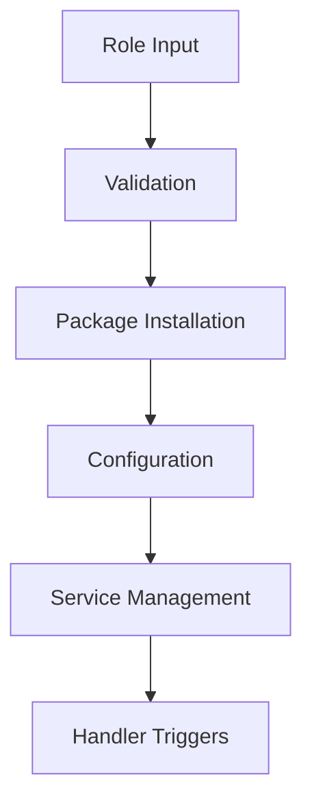

<!-- DOCSIBLE METADATA
generated_at: 2025-12-19T09:55:33.058442+00:00Z
docsible_version: 0.8.0
role_hash: 9f5db66940d046875aea45c86aa4d2051bdc813d4035e3e95df1278db8f8758a
-->
<!-- DOCSIBLE START -->


# complex_role
<!-- MANUALLY MAINTAINED -->
> **Note**: Replace this section with your role's description
>
> Brief description of role purpose and scope. Explain what problem this role solves
> and what it accomplishes.

## Quick Start
<!-- MANUALLY MAINTAINED -->
Minimal example for immediate usage:
```yaml
- hosts: servers
  roles:
    - { role: complex_role, variable_key: "value" }
```

## Architecture Overview
<!-- MANUALLY MAINTAINED -->
> **Note**: Add high-level explanation of what the role does and how components interact

> **Note**: Add a high-level architecture diagram below. Use `--graph` flag with a playbook to auto-generate sequence diagram.

*Customize the mermaid diagram above to match your role's architecture.*

---

## Role Complexity Analysis

**Complexity Level:** <span style="color: orange">MEDIUM</span>

### Metrics

| Metric | Value |
|--------|-------|
| Total Tasks | 13 |
| Task Files | 4 |
| Handlers | 3 |
| Conditional Tasks | 3 (23%) |
| Error Handlers | 0 |
| Max Tasks per File | 5 |
| Role Dependencies | 2 |
| Task Includes | 3 |

### External Integrations (1)

This role integrates with external systems:

**1. REST APIs** (api)
- **Modules Used:** `ansible.builtin.get_url`
- **Tasks Count:** 1

### Composition Score

**Internal Orchestration:** 7 (Medium)
- Role Dependencies: 2
- Task Includes: 3

### Recommendations
- ✅ Role complexity is well-managed - standard documentation is sufficient

### Visualization Strategy

**For MEDIUM roles** (13 tasks):
- ✅ State diagrams show workflow phases
- ✅ Sequence diagrams show detailed execution
- ✅ Component hierarchy shows task organization

---


## Simplification Opportunities

**Overall Health Score:** <span style="color: green">98/100</span>

This role has **1** potential improvement:
- 🚨 Critical: 0
- ⚠️  Warnings: 0
- 💡 Suggestions: 1

### 💡 Optional Improvements

<details>
<summary><strong>Magic Values</strong> - Found 2 repeated literal values across tasks</summary>

**Example:**
```yaml
```
'ansible.builtin.file' used 3 times
'ansible.builtin.include_tasks' used 3 times
```
```

**Suggestion:**
Replace magic values with variables:

**Instead of hardcoding:**
```yaml
- name: Create directory
  file:
    path: /opt/myapp  # ← Hardcoded
    state: directory

- name: Copy config
  copy:
    dest: /opt/myapp/config.yml  # ← Repeated
```

**Use variables:**
```yaml
# defaults/main.yml
app_install_dir: /opt/myapp
app_config_file: "{{ app_install_dir }}/config.yml"
```

```yaml
# tasks/main.yml
- name: Create directory
  file:
    path: "{{ app_install_dir }}"
    state: directory

- name: Copy config
  copy:
    dest: "{{ app_config_file }}"
```

**Benefits:**
- Single source of truth
- Easy to change paths
- Better for multi-environment deployments

**Expected benefit:** Improves flexibility and reduces change burden
**Files:** `uninstall.yml`, `main.yml`, `prerequisites.yml`

</details>

### Pattern Categories Summary
| Category | Count |
|----------|-------|
| Maintainability | 1 |

### Next Steps
1. **Review optional suggestions** - Fine-tune role to perfection

---


## Task Dependency Matrix

*This role has 13 tasks. The table below shows task relationships for understanding execution dependencies and troubleshooting.*

| Task | File | Module | Requires | Triggers | Error Handling | Sets Facts |
|------|------|--------|----------|----------|----------------|------------|
| Stop application service | `uninstall.yml` | `ansible.builtin.service` | - | - | None | - |
| Remove application directory | `uninstall.yml` | `ansible.builtin.file` | - | - | None | - |
| Remove configuration | `uninstall.yml` | `ansible.builtin.file` | - | - | None | - |
| Install required packages | `prerequisites.yml` | `ansible.builtin.apt` | - | - | None | - |
| Create application directory | `prerequisites.yml` | `ansible.builtin.file` | - | - | None | - |
| Download application | `install.yml` | `ansible.builtin.get_url` | - | - | None | - |
| Extract application | `install.yml` | `ansible.builtin.unarchive` | - | - | None | - |
| Install Python dependencies | `install.yml` | `ansible.builtin.pip` | - | - | None | - |
| Include prerequisites | `main.yml` | `ansible.builtin.include_tasks` | - | - | None | - |
| Install application | `main.yml` | `ansible.builtin.include_tasks` | - | - | None | - |
| Remove application | `main.yml` | `ansible.builtin.include_tasks` | - | - | None | - |
| Configure application | `main.yml` | `ansible.builtin.template` | - | - | None | - |
| Ensure service state | `main.yml` | `ansible.builtin.service` | - | - | None | - |

### How to Use This Table

- **Task**: Task name from the playbook
- **File**: Task file location
- **Module**: Ansible module used
- **Requires**: Variables or facts this task depends on
- **Triggers**: Handlers notified when this task reports changes
- **Error Handling**: Error recovery strategy (rescue/always blocks)
- **Sets Facts**: Variables or facts this task defines for later use

### Dependency Patterns

**Summary Statistics:**
- Total Tasks: 13
- Tasks with Variable Dependencies: 0
- Tasks Triggering Handlers: 0
- Tasks with Error Handling: 0
- Tasks Setting Facts: 0

<details>
<summary><b>💡 Understanding Task Dependencies</b></summary>

**Variable Dependencies (Requires):**
- Shows which variables/facts must be defined before task execution
- Helpful for understanding task prerequisites
- Critical for troubleshooting "undefined variable" errors

**Handler Triggers:**
- Shows which handlers are notified when task state changes
- Essential for understanding service restart cascades
- Helps identify which tasks trigger notifications

**Error Handling:**
- `rescue`: Task has error recovery logic
- `always`: Task has cleanup logic that always runs
- `rescue + always`: Task has both error recovery and cleanup
- `None`: Task has no explicit error handling

**Facts Set:**
- Variables registered or set by this task
- Available for use by subsequent tasks
- Critical for understanding data flow through the role

</details>

---

## Task Execution Flow
<!-- DOCSIBLE GENERATED -->
> Generated via: `docsible --role . --graph --comments --no-backup`


---


### Handlers
| Handler Name | Module | Listens To | File |
|--------------|--------|------------|------|
| Restart application | ansible.builtin.service | N/A | main.yml |
| Reload application | ansible.builtin.service | N/A | main.yml |
| Clear cache | ansible.builtin.command | clear cache | main.yml |


---


## Role Variables
<!-- DOCSIBLE GENERATED -->

### Default Variables
The following variables are defined in `defaults/` with their default values:
#### File: `defaults/main.yml`

| Variable | Default Value | Type | Description |
|----------|---------------|------|-------------|
| `title` | *See YAML* | str |  |
| `description` | *See YAML* | str |  |
| `state` | *See YAML* | dict |  |
| `state.default` | *See YAML* | str |  |
| `state.choices` | *See YAML* | list |  |
| `state.choices.0` | *See YAML* | str |  |
| `state.choices.1` | *See YAML* | str |  |
| `state.description` | *See YAML* | str |  |
| `app_name` | *See YAML* | str |  |
| `app_version` | *See YAML* | str |  |
| `app_port` | `3000` | int |  |
| `database_config` | *See YAML* | dict |  |
| `database_config.host` | *See YAML* | str |  |
| `database_config.port` | `5432` | int |  |
| `database_config.name` | *See YAML* | str |  |
| `database_config.user` | *See YAML* | str |  |
| `feature_flags` | *See YAML* | dict |  |
| `feature_flags.enable_cache` | `True` | bool |  |
| `feature_flags.enable_monitoring` | `False` | bool |  |
| `feature_flags.debug_mode` | `False` | bool |  |


---


## Dependencies
<!-- DOCSIBLE GENERATED + MANUAL ADDITIONS -->


### Role Dependencies

- `common`

- `hashi_vault`


### Execution Order Notes
<!-- MANUALLY MAINTAINED -->
> **Note**: Add important sequencing information and dependency rationale here
>
> Example:
> - This role must run after `common` role to ensure base packages are installed
> - Database initialization tasks depend on the service being started first
> - Configuration changes trigger handler restarts automatically

---


## Example Playbooks
<!-- MANUALLY MAINTAINED -->
### Basic Usage
```yaml
- hosts: servers
  roles:
    - role: complex_role
      # Add your basic variables here
      # variable_name: value
```

### Advanced Configuration
```yaml
- hosts: servers
  vars:
    # Add complex variable examples here
    # complex_variable:
    #   - item1: value1
    #     item2: value2
  roles:
    - complex_role
```

### Multiple Environments
```yaml
# Production
- hosts: production_servers
  roles:
    - role: complex_role
      environment: production

# Staging
- hosts: staging_servers
  roles:
    - role: complex_role
      environment: staging
```
---


## Task Details
<!-- DOCSIBLE GENERATED -->

### File: `tasks/uninstall.yml`

| Task Name | Module | Description |
|-----------|--------|-------------|
| Stop application service | ansible.builtin.service | |
| Remove application directory | ansible.builtin.file | |
| Remove configuration | ansible.builtin.file | |


### File: `tasks/prerequisites.yml`

| Task Name | Module | Description |
|-----------|--------|-------------|
| Install required packages | ansible.builtin.apt | |
| Create application directory | ansible.builtin.file | |


### File: `tasks/install.yml`

| Task Name | Module | Description |
|-----------|--------|-------------|
| Download application | ansible.builtin.get_url | |
| Extract application | ansible.builtin.unarchive | |
| Install Python dependencies | ansible.builtin.pip | |


### File: `tasks/main.yml`

| Task Name | Module | Description |
|-----------|--------|-------------|
| Include prerequisites | ansible.builtin.include_tasks | |
| Install application | ansible.builtin.include_tasks | |
| Remove application | ansible.builtin.include_tasks | |
| Configure application | ansible.builtin.template | |
| Ensure service state | ansible.builtin.service | |


---

## Testing
<!-- MANUALLY MAINTAINED -->
> **Note**: Add testing instructions here

### Test Environment Setup
```bash
# Example test setup commands
# ansible-playbook tests/test.yml -i tests/inventory
```

### Validation Steps
1. Verify service is running
2. Check configuration files are in place
3. Validate connectivity/functionality

### Molecule Testing (Optional)
```bash
# If using Molecule for testing
# molecule test
```

---


## Compatibility
<!-- MANUALLY MAINTAINED -->
### Supported Operating Systems
- Ubuntu 20.04, 22.04
- Debian 10, 11
- CentOS 7, 8
- RHEL 7, 8

### Requirements
- **Ansible version**: >= 2.10
- **Python version**: >= 3.6
- **Privilege level**: root/sudo required

### Known Limitations
> **Note**: Document any known issues or limitations here

---


## Role Metadata
<!-- DOCSIBLE GENERATED -->


### Galaxy Info
- **Author**: Test Author
- **Company**: Test Company
- **License**: MIT
- **Min Ansible Version**: 2.1

#### Supported Platforms

- Ubuntu: focal, jammy

- Debian: bullseye


#### Galaxy Tags
test, complex, state-management


---

## License & Author
<!-- MANUALLY MAINTAINED -->

**License**: MIT

**Author**: Test Author


### Contributing
Contributions are welcome! Please:
1. Fork the repository
2. Create a feature branch
3. Make your changes
4. Submit a pull request

---


## Changelog
<!-- MANUALLY MAINTAINED -->
### [Version] - Date
**Added**
- New feature description

**Changed**
- Modified behavior description

**Fixed**
- Bug fix description

---
*This documentation was generated with [Docsible](https://github.com/docsible/docsible)*

<!-- DOCSIBLE END -->